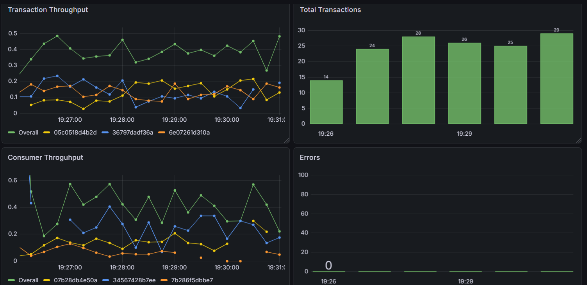

# TrStream
*A distributed real-time transaction processing pipeline*

<div align="left">


</div>

<div align="left">

> **This is a hands-on exploration of distributed data systems.** <br>
> Simulates how modern fintech platforms ingest, process and analyze transaction streams at scale.  <br>
> Built to understand event-driven architectures, lakehouse storage patterns and observability practices with production-grade tooling.

</div>

## About
TrStream simulates a production-grade financial transaction pipeline that:

- Ingests events from payment providers and synthetic producers
- Streams through Kafka for buffering and decoupling
- Stores data in a lakehouse architecture (raw, processed, analytics)
- Exposes SQL queries over optimized Parquet files
- Monitors performance with Prometheus and Grafana

## Architecture


## Key Features

- **Webhook ingestion** with signature verification (Stripe, Revolut)
- **Synthetic producers** simulating transaction streams with configurable rates
- **Kafka partitioning** for horizontal scalability
- **Clear data lifecycle stages**: raw → processed → analytics
- **SQL querying** on object storage with DuckDB
- **Prometheus metrics** and **Grafana dashboards** for observability

## Integrations

### Stripe
Real-time webhook events for payment transactions, with signature verification and validation ([Setup Guide](src/integrations/stripe/README.md)).

### Revolut
Sandbox API + Redis queue + Vercel serverless webhook for transfers ([Setup Guide](src/integrations/revolut/README.md)).

## Screenshots

<details>
<summary><b>Kafka UI</b> - Monitor topics, partitions and consumer groups</summary>


</details>

<details>
<summary><b>MinIO Console</b> - Browse buckets, manage storage and file metadata</summary>


</details>

<details>
<summary><b>SQL Editor</b> - Interactive query interface</summary>


</details>

<details>
<summary><b>Grafana Dashboard</b> - Metrics and performance</summary>


</details>

## Prerequisites
- Docker & Docker Compose
- Python 3.10+ (for local script execution)

## Quick Start
```bash
# 1. Clone
git clone https://github.com/AlessioCappello2/TrStream.git && cd TrStream

# 2. Setup environment variables (see .env.example in config/env/)
cp config/env/services/producer.env.example config/env/services/producer.env
# Edit .env with desired configuration

# 3. Build (after having set up env variables)
scripts/scripts-cli/build.sh

# 4. Run everything
scripts/scripts-cli/run_all.sh
``` 

## Local Access Points
| Service | URL | Credentials |
|---------|-----|-------------|
| **Kafka UI** | http://localhost:8080 | — |
| **MinIO Console** | http://localhost:9001 | `admin` / `admin12345` |
| **Grafana** | http://localhost:3000 | `admin` / `admin` |
| **SQL Editor** | http://localhost:8501 | — |
| **Query API** | http://localhost:8000/docs | — |
| **Prometheus** | http://localhost:9090 | — |

## Roadmap

### Completed
- [x] Kafka-based event streaming
- [x] Multi-stage data lifecycle (raw → processed → analytics)
- [x] DuckDB query layer with Streamlit SQL editor
- [x] Stripe & Revolut integrations
- [x] Prometheus metrics and Grafana dashboards for observability
- [x] Custom scheduler for processing and compaction jobs

### Possible Future additions
- Additional payment provider integrations (e.g. Adyen, PayPal)
- Real-time alerting and anomaly detection on transaction streams

## License

This project is licensed under the MIT License - see the [LICENSE](LICENSE) file for details.

---

## Tech stack
| Component/Layer     | Technology                   |
|---------------|------------------------------|
| Ingestion     | Kafka, Webhooks              |
| Messaging     | Kafka  |
| Storage       | MinIO (S3-compatible)        |
| Processing    | Python, PyArrow, Boto3       |
| Query engine  | DuckDB                       |
| API layer     | FastAPI                      |
| Visualization | Streamlit                    |
| Monitoring    | Kafka UI (Provectus Labs)    |
| Orchestration | Docker Compose               |
| Performance  | Prometheus, Grafana          |