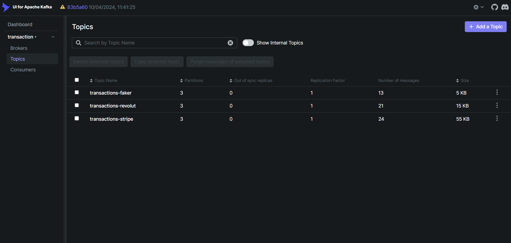
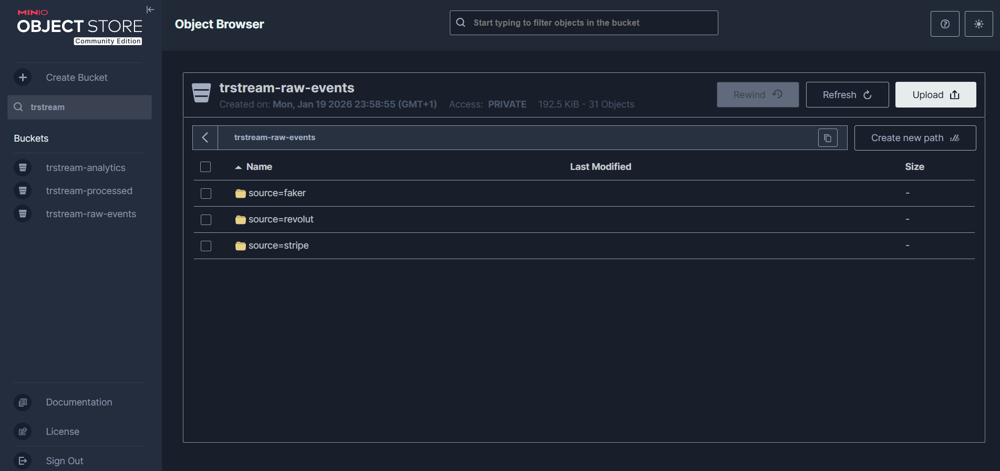
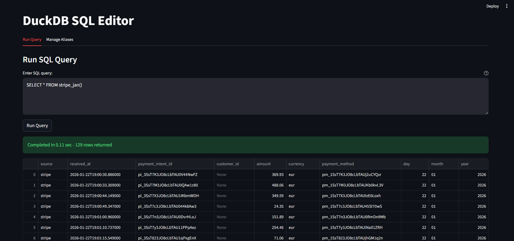
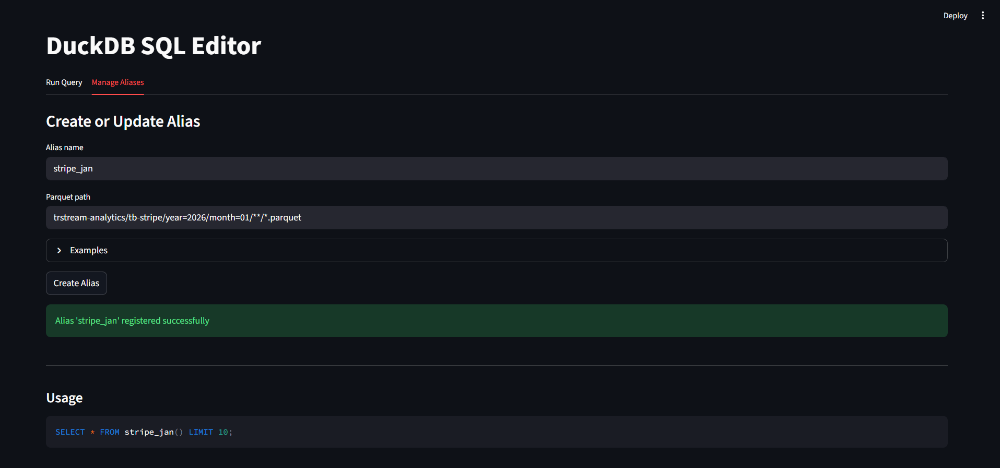

# TrStream
<div align="center">

[](https://opensource.org/licenses/MIT)
[](https://www.python.org/downloads/)
[](https://www.docker.com/)
[](https://github.com/AlessioCappello2/TrStream/graphs/commit-activity)

**A distributed real-time transaction processing pipeline**

[Quick Start](#quick-start) - [Architecture](#architecture) - [Features](#key-features) - [Integrations](#integrations)

</div>

---

<div align="center">


</div>

## Table of Contents
- [About](#about)
- [Motivation](#motivation)
- [Overview](#overview)
- [Key features](#key-features)
- [Architecture](#architecture)
- [Data flow](#data-flow)
- [Screenshots](#screenshots)
- [Quick Start](#quick-start)
- [Integrations](#integrations)
- [Tech stack](#tech-stack)
- [Local Access Points](#local-access-points)
- [Roadmap](#roadmap)
- [License](#license)

## About
TrStream is a distributed data pipeline designed to simulate and process high-throughput financial transaction streams in real time.

The project explores the architectural patterns behind modern fintech and data engineering systems, including:
- Event-driven ingestion
- Scalable stream processing
- Lakehouse-style storage
- Analytical querying

It was developed as a personal project to apply concepts from [Designing Data-Intensive Applications](https://www.oreilly.com/library/view/designing-data-intensive-applications/9781491903063/) (Martin Kleppmann) with a strong focus on **system design** and data flow.

## Motivation

Modern financial platforms ingest millions of events per day and must:
- Reliably process asynchronous events
- Retain raw events for auditing and replay
- Progressively optimize data layout for analytics
- Remain horizontally scalable and loosely coupled

TrStream models this workflow locally using open-source technologies, emphasizing clear data stages and realistic ingestion patterns.

## Overview
At a high level, the pipeline:
1. Ingests transaction events from external systems (e.g. Stripe webhooks) and internal producers
2. Buffers and distributes events via Kafka
3. Persists immutable raw events in a data lake (Parquet on S3-compatible storage)
4. Processes and reorganizes data into optimized analytical layouts
5. Exposes a SQL query layer on analytics-ready data

All components are containerized and orchestrated with Docker Compose, allowing horizontal scaling of producers and consumers.

## Key features
- **Event-driven ingestion** via webhooks and producers
- **Kafka-based buffering** with horizontal scalability through partitioning
- Clear separation of **data lifecycle stages**: raw → processed → analytics
- **Immutable Parquet storage** for auditing and replay
- **File compaction** and **layout optimization** for analytical workloads
- **SQL querying** on object storage (Athena-like experience)
- **Lightweight SQL editor** implemented with Streamlit
- **Fully containerized local environment** with Docker Compose orchestration and explicit health checks

## Architecture


## Data flow
- **Event sources**
    - External providers (e.g. Stripe) deliver events through a webhook service
    - Internal producers simulate transaction streams with configurable rates and distributions
- **Kafka ingestion**
    - All events are published to Kafka topics
    - Kafka provides buffering, ordering, partitioning and backpressure handling
    - Kafka UI exposes end-to-end observability of topics and consumers
- **Consumers and storage**
    - Kafka consumers persist events to MinIO (S3-compatible storage)
    - Data flows through explicit lifecycle stages:
        - **Raw**: immutable, append-only Parquet files mirroring incoming events
        - **Processed**: cleaned and normalized data derived from raw events
        - **Analytics**: compacted and query-optimized Parquet files
- **Processing and compaction**
    - A processor transforms raw data into cleaned and normalized datasets
    - A compacter merges small files and optimizes layout for analytical queries
    - Both services are schema- and source-aware, ensuring consistent and query-ready outputs
- **Query and visualization**
    - A query service exposes SQL access (DuckDB-based) over analytics data
    - A Streamlit UI provides an interactive SQL editor for data exploration

## Screenshots

**Kafka UI**: monitor topics, partitions, and consumer groups in real time



**MinIO Console**: browse buckets, view file metadata, and manage storage



**SQL Editor**: write and execute SQL queries against analytics data






## Quick Start

### Prerequisites
- Docker and Docker Compose installed locally
- Python 3.10+ 

### Launch the pipeline
1. **Clone the repository:**
```bash
git clone https://github.com/AlessioCappello2/TrStream.git
cd TrStream
```

2. **Build all images:**
```bash
scripts/scripts-cli/build.sh
```

3. **Start core services:**
```bash
scripts/scripts-cli/run.sh
```

4. **Start everything (including UI):**
```bash
scripts/scripts-cli/run_all.sh
```

5. **Access the services:**
    - **Kafka UI**: http://localhost:8080
    - **MinIO Console**: http://localhost:9001
    - **SQL Query API**: http://localhost:8000
    - **SQL Editor**: http://localhost:8501

### Scaling

Scale producers and consumers horizontally:
```bash
scripts/scripts-cli/run.sh producer=3 consumer=4
```

See [scripts documentation](scripts/scripts-cli/README.md) for more options.

## Integrations

TrStream supports real-world payment provider integrations:

### Stripe
- **Webhook ingestion** for payment events
- Signature verification and validation
- [Setup Guide](src/integrations/stripe/README.md)

### Revolut
- **Sandbox API integration** for transaction data
- Redis-backed event queue and serverless webhook deployment with Vercel
- [Setup Guide](src/integrations/revolut/README.md)

Each integration is independently deployable and configurable, allowing users to choose which data sources to include in their pipeline. 

## Tech stack
| Component     | Technology                   |
|---------------|------------------------------|
| Ingestion     | Kafka, Webhooks              |
| Messaging     | Kafka (Bitnami legacy image) |
| Storage       | MinIO (S3-compatible)        |
| Processing    | Python, PyArrow, Boto3       |
| Query engine  | DuckDB                       |
| API layer     | FastAPI                      |
| Visualization | Streamlit                    |
| Monitoring    | Kafka UI (Provectus Labs)    |
| Orchestration | Docker Compose               |

## Local Access Points

| Component | URL |
| --------- | --- |
| Stripe Webhook | http://localhost:8100 |
| Kafka UI | http://localhost:8080 |
| MinIO Browser | http://localhost:9000 |
| MinIO Console | http://localhost:9001 |
| SQL Querier API | http://localhost:8000 |
| Streamlit Editor | http://localhost:8501 |

**Backend Services (no web interface):**
- **Kafka**: `localhost:9092` (connect via Kafka clients)

> **Tip:** Use Kafka UI to monitor Kafka topics and messages.

## Roadmap

### Completed
- [x] Kafka-based event streaming
- [x] Multi-stage data lifecycle (raw → processed → analytics)
- [x] DuckDB query layer
- [x] Streamlit SQL editor
- [x] Stripe integration with webhook handling
- [x] Revolut integration with sandbox API

### Planned
- [ ] **Observability**
    - Prometheus metrics  
    - Grafana dashboards
- [ ] **Job scheduling**
    - Airflow DAGs for processing and compaction

### Future considerations
- Additional payment provider integrations (e.g. Adyen, PayPal)
- Real-time alerting and anomaly detection on transaction streams

## License

This project is licensed under the MIT License - see the [LICENSE](LICENSE) file for details.